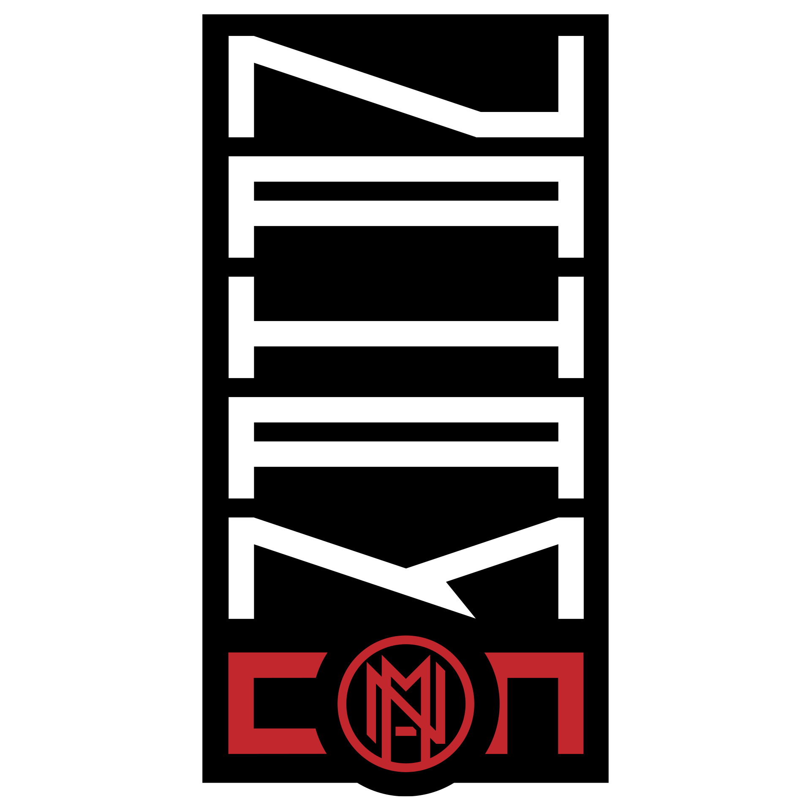

# General

NahamCon EU CTF 2022

December 16th, 12:00 PM - December 17th, 12:00 PM PST
24-Hour Competition

## Rules

We don't want to have to enforce restrictions on you, but there are a few things we would like to politely ask you not to do:

1. Please do not attack the competition infrastructure or other players. The challenges are your targets. That's it.
1. You do not need to use automated scanners like sqlmap, DirBuster, nmap, Metasploit, nikto or others. Please do not use them against the challenges.
1. Please do not brute-force flags.
1. Please do not share flags with other players, or explicitly and deliberately cheat.
1. **Please do not blatantly ask for hints.** The proper to way to ask for help is to explain what you have tried and showcase(in a direct message) what errors or output you may have.

## Flag Format

Flags for this competition will follow the format: `flag\{[0-9a-f]{32}\}`. That means a ``flag{}`` wrapper with what looks like an MD5 hash inside the curly braces. If you look closely, you can even find a flag on this page!

## Support

For admin support in the case of any technical issues, please join the NahamSec Discord server: [https://discord.com/invite/ucCz7uh](https://discord.com/invite/ucCz7uh).

You should find a #ctf channel in the **NahamCon 2022** category and direct your questions there. When your question requires discussing a specific challenge, please direct message one of the challenge authors as noted in the challenge description.
