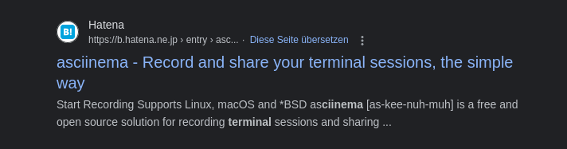
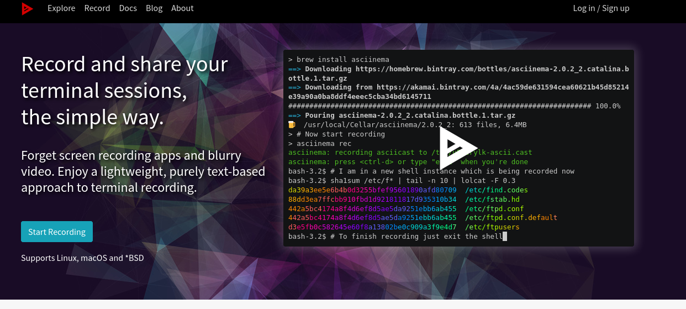

<span style="color:red; font-weight:bold;">Not solved in the time of the CTF!</span>

# 2 the Movies

Easy
Category: Forensics
Writeup from: w3ich3rt

Here is a file for you to play with...I think there was something in it, but I haven't played with it in such a long time I forgot!

You might need Linux or Mac for solving this.

Flag: `RUSH{ALL_CAPS_MESSAGE}`

File [2_the_Movies](2_the_Movies) 


## Solving

After some digging around with the mighty help of the internet I couldn't find anything.
It was clearly some kind of terminal session log, but which one... 

In the terminallog there is one line... 

```text
[snippet]
u001b[36m~/Desktop/**CIINEMA\u001b[0m\u001b
```

So let's check if there is anything to record terminal sessions.

So there is something... called `asciinema`.

 

 

So let's install the software and try it out.

```shell
sudo apt install asciinema

asciinema play 2_the_Movies
```

After running the second command, the recorded session starts to play. And there is the flag!


> Flag:
> RUSH{T3RM1N4L_MOOOV135_4R3_COOOL}