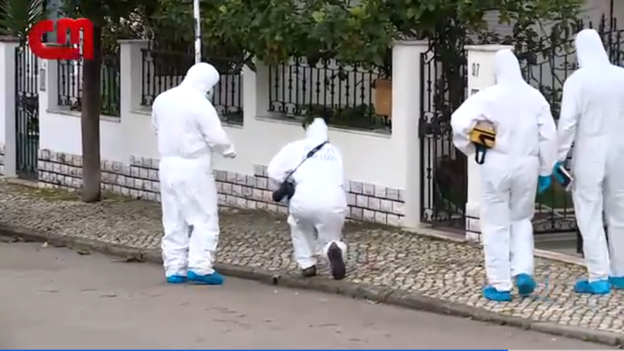
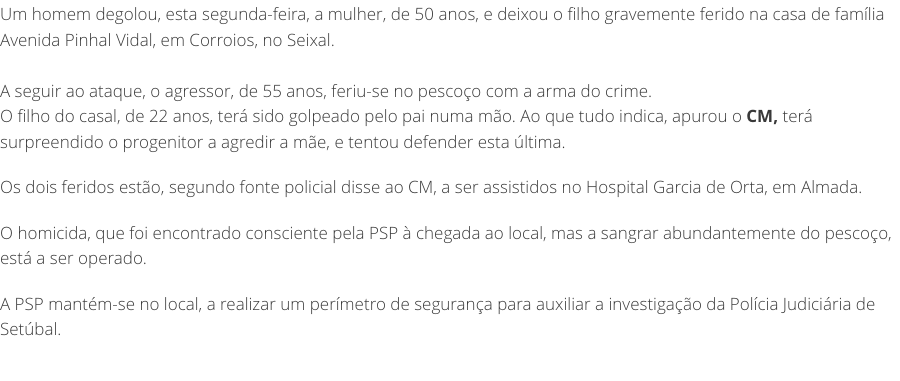
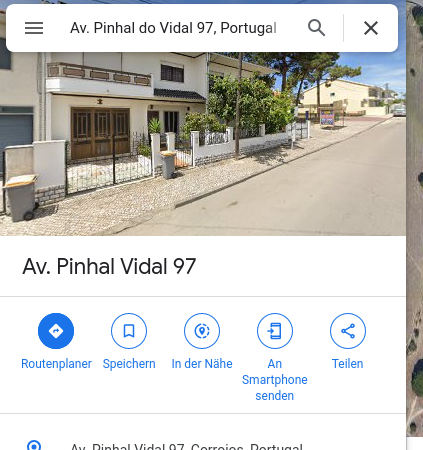
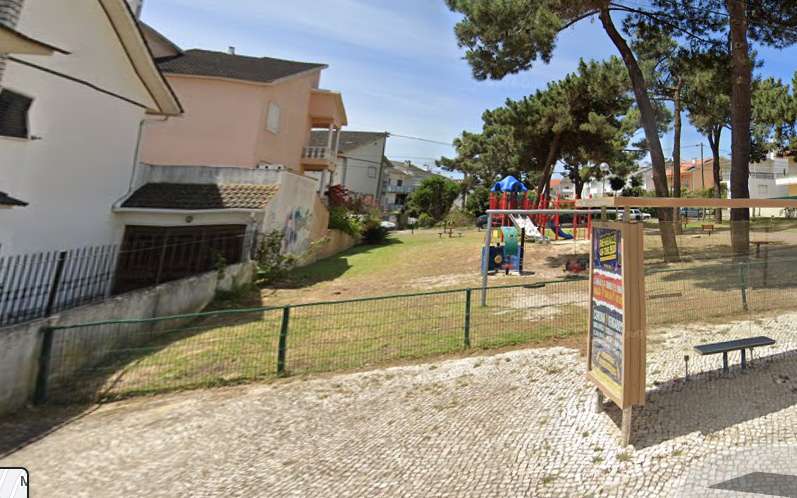
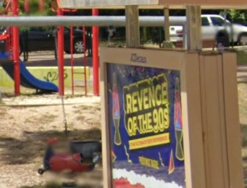
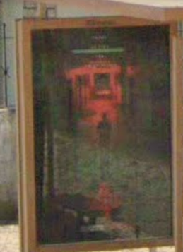
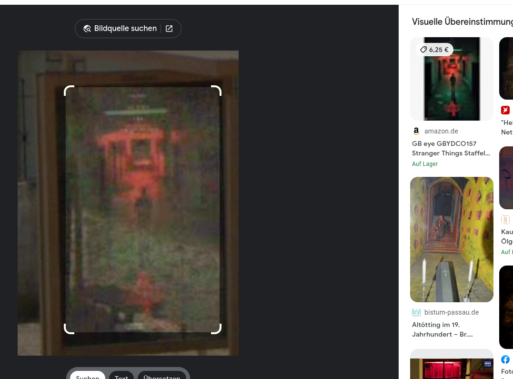
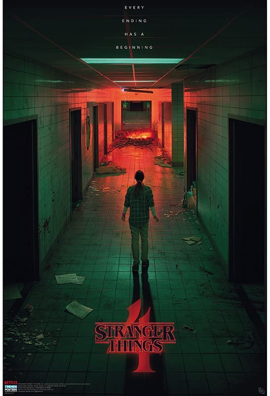

# CMTV Depression 1 and 2

Medium

## Challenge description

[https://t.ly/Z_wg4](https://t.ly/Z_wg4)

Find the murder house, what is the event being advertised? That's flag1!

For extra points, what about the TV show and season number?
That's flag2!

Flag: `RUSH{ALLCAPSMESSAGE}`

> RUSH{REVENGEOFTHE90S}

## Solving

The link will open a news-page, that shows an article about a murder. In the video (embedded in the website) we can see the number of the house(97) and in the article we can get the street and city of the family that were attacked. So we have everthing for some google action.

Here is a picture of the video and the house number

And here is the article

So the address we need to google should be:

> Av. Pinhal do Vidal 97, Portugal

Okay let's open Google Street View on the address and look around. If we look closely we can see a busstop. There is a poster for an event. This should be the first flag!

> RUSH{REVENGEOFTHE90S}

### Second flag

We can find the second flag on the other side of the busstop poster. 
Just go to the next Google Street View point and look at the busstop poster.

Sadly I cannot really guess what TV show this would be... but it looks kind of familier. I took the picture snippet and posted it in the google image search.

Yeah. Stranger Things... season 4. I love stranger things. :-)

> RUSH{STRANGERTHINGS4}