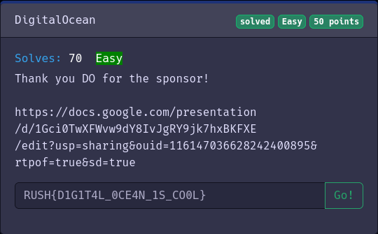

# webuser@security-client:~$ cat digital_ocean.md

# DigitalOcean

Easy
Category: Forensics
Writeup from: w3ich3rt

## Challenge description

Thank you DO for the sponsor!

[https://docs.google.com/presentation/d/1Gci0TwXFWvw9dY8IvJgRY9jk7hxBKFXE/edit?usp=sharing&ouid=116147036628242400895&rtpof=true&sd=true](https://docs.google.com/presentation/d/1Gci0TwXFWvw9dY8IvJgRY9jk7hxBKFXE/edit?usp=sharing&ouid=116147036628242400895&rtpof=true&sd=true)

## Solving

I just opened the link and looked through the slidedeck of digitalocean. 
After looking closely through the deck I recognized that on some decks, there are parts of the flag.

Slides: 3, 11, 15

> Flag:
> RUSH{D1G1T4L_0CE4N_1S_CO0L}