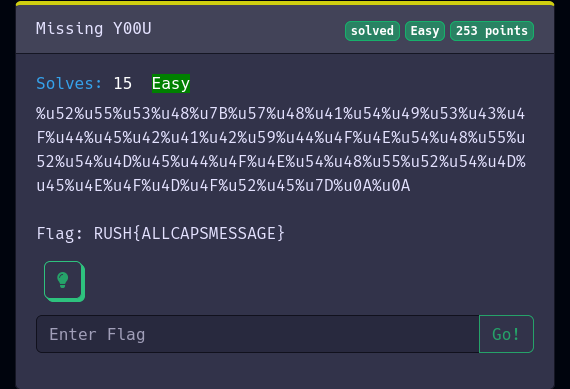

# Missing Y00U
Easy
Category: Warmup

## Challenge description

`%u52%u55%u53%u48%u7B%u57%u48%u41%u54%u49%u53%u43%u4F%u44%u45%u42%u41%u42%u59%u44%u4F%u4E%u54%u48%u55%u52%u54%u4D%u45%u44%u4F%u4E%u54%u48%u55%u52%u54%u4D%u45%u4E%u4F%u4D%u4F%u52%u45%u7D%u0A%u0A`

> Flag: RUSH{ALLCAPSMESSAGE}

## Solving

The strings looks like the URL encoded strings. But the `u` is not right. I searched a bit through the internet, but couldn't find anything.
So I removed the `u`s from the string.

`%52%55%53%48%7B%57%48%41%54%49%53%43%4F%44%45%42%41%42%59%44%4F%4E%54%48%55%52%54%4D%45%44%4F%4E%54%48%55%52%54%4D%45%4E%4F%4D%4F%52%45%7D%0A%0A`

After that I used [cyberchef.io](https://gchq.github.io/) to decode the string.

1. Copy the string into the input field
2. Use `URL Decode` on that string
3. Get your flag!

> Flag:
> RUSH{WHATISCODEBABYDONTHURTMEDONTHURTMENOMORE}
