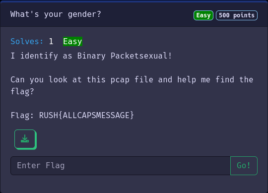

<span style="color:red; font-weight:bold;">Not solved by use while the CTF!</span>

# <span style="color: cyan;">webuser</span>@<span style="color: darkorange;">security-client</span>:~$ <span style="color: white;">cat</span> whats-your-gender.md

# What's your gender?

Easy
Category: Forensics
Writeup from: w3ich3rt

## Challenge description

I identify as Binary Packetsexual!

Can you look at this pcap file and help me find the flag?

Flag: RUSH{ALLCAPSMESSAGE}

[PCAP-File](Whats_your_gender.pcap)

 

## Solving

Looking at the `pcap`-File with `Wireshark` and the python lib `scapy`.
But nothing pops up... :-D

Checked without result:
 [x] `strings`
 [x] `wireshark`
 [x] `tshark`
 [x] `scapy`

## Explanation

Okay after reading some writeups in form of the scripts, the solution is the destination IP address.
This IP-addresses are the key, because when we look at the third octet we may find out, that this is binary.
So if you take this `0001010101` strings you can convert it to ascii and get the flag.
Therefore you can use this script.

### Scapy script

Writeupscript from *TheJeorgen#8071* and modified by w3ich3rt:

```python
#!/usr/bin/env python3

from scapy.all import *


def decode_binary_string(s, encoding='UTF-8'):
    """Converting the byts to string"""
    byte_string = ''.join(chr(int(s[i*8:i*8+8], 2)) for i in range(len(s)//8))
    return byte_string


packets = rdpcap('Whats_your_gender.pcap')
count = 0
flag = ""

for pck in packets:
    if pck[IP].src != "1.2.3.4":
        flag += pck[IP].dst[-3]+pck[IP].dst[-1]
        count += 1
        if count % 4 == 0 :
            flag += ""

print(decode_binary_string(flag))
```
